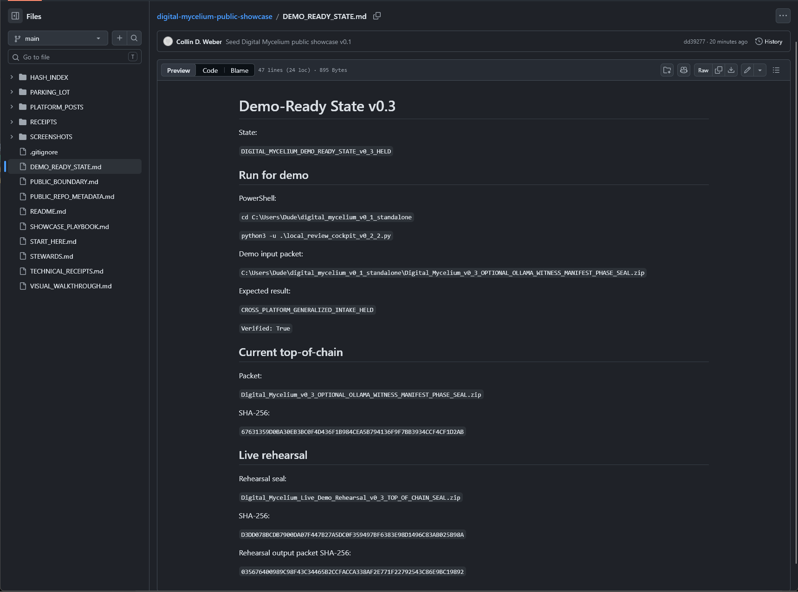
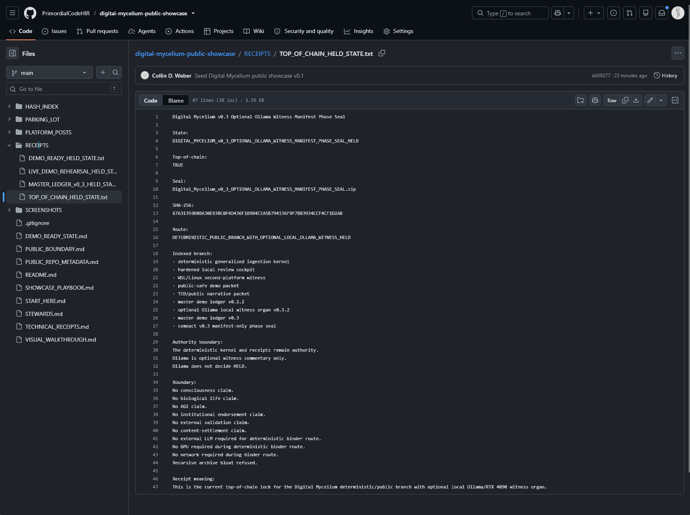
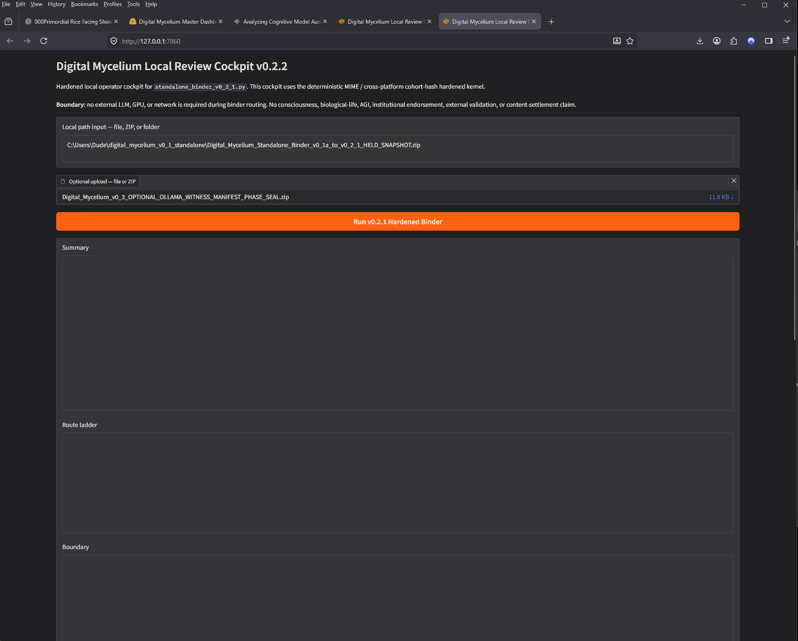
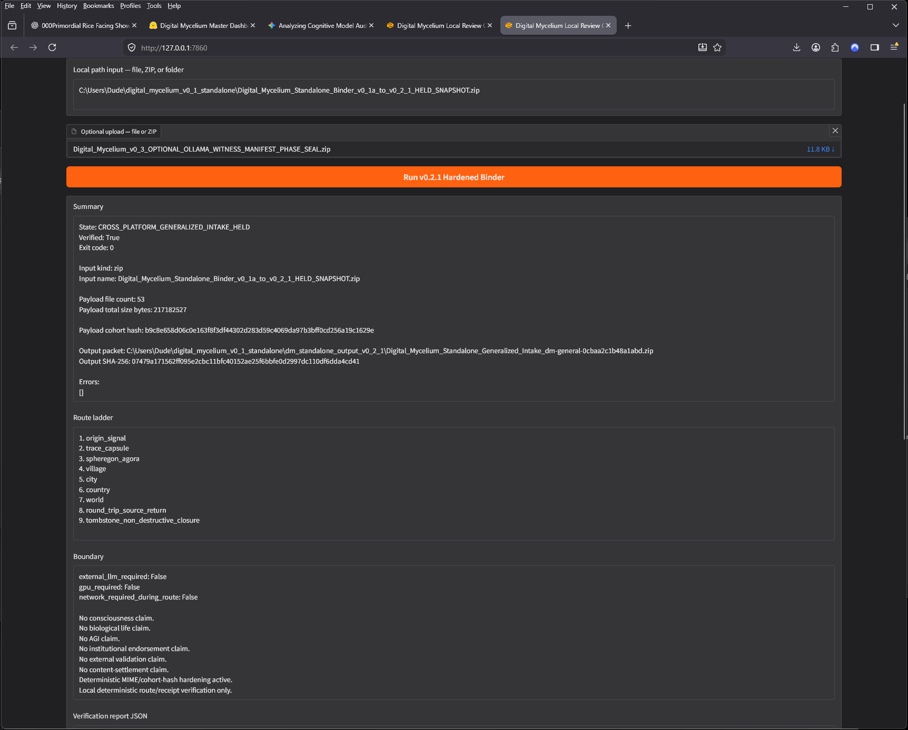
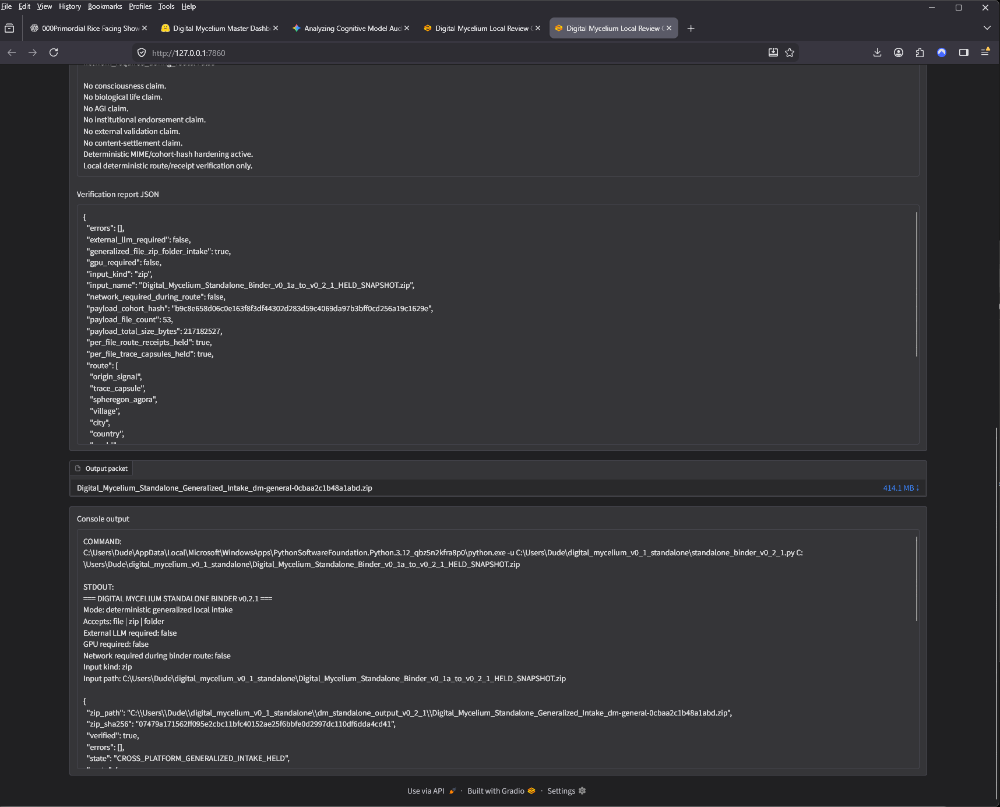
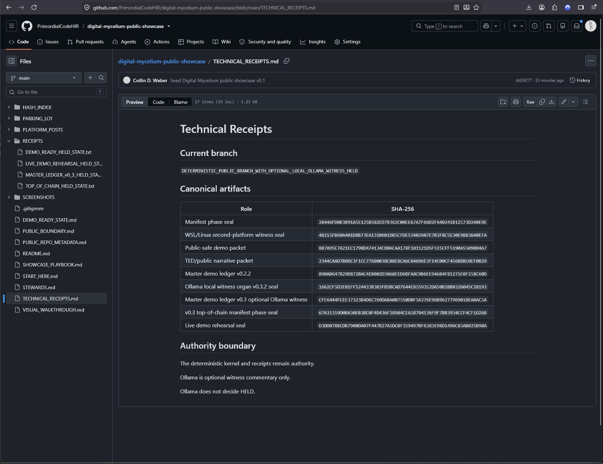
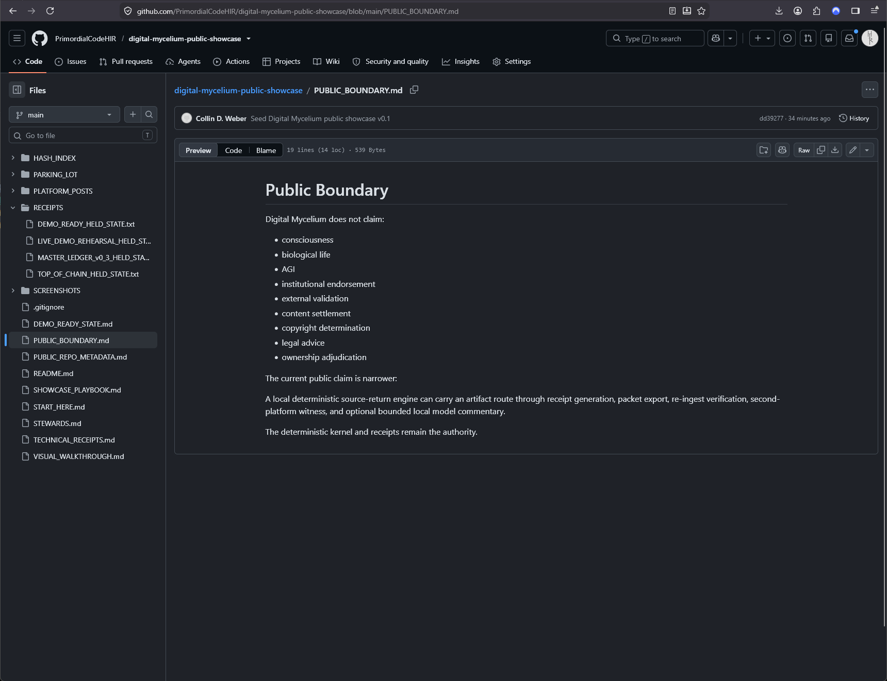

# Visual Walkthrough

This page gives a quick visual route through the current Digital Mycelium v0.3 public showcase.

The goal is simple:

A visitor should be able to see the route before reading every receipt.

---

## 1. Demo-ready state

Shows the current demo-ready state and public route lock.

---

## 2. Top-of-chain state

Shows the current v0.3 top-of-chain manifest phase seal.

---

## 3. Cockpit input

Shows the hardened local cockpit with the current top-of-chain packet selected.

---

## 4. Cross-platform held result

Shows the deterministic binder route returning a held/verified result.

Expected core signal:

`CROSS_PLATFORM_GENERALIZED_INTAKE_HELD`

Result view 1:

Result view 2:

---

## 5. Technical receipts

Shows the public receipt/index page.

---

## 6. Public boundary

Shows the public boundary page.

---

## Screenshot receipt index

Screenshot SHA-256 values are recorded in:

`SCREENSHOTS/SCREENSHOT_INDEX_v0_1.json`

## Boundary

These screenshots are public-comprehension aids.

They do not replace the deterministic receipts.

They do not create any claim of consciousness, biological life, AGI, institutional endorsement, external validation, legal conclusion, or content settlement.
